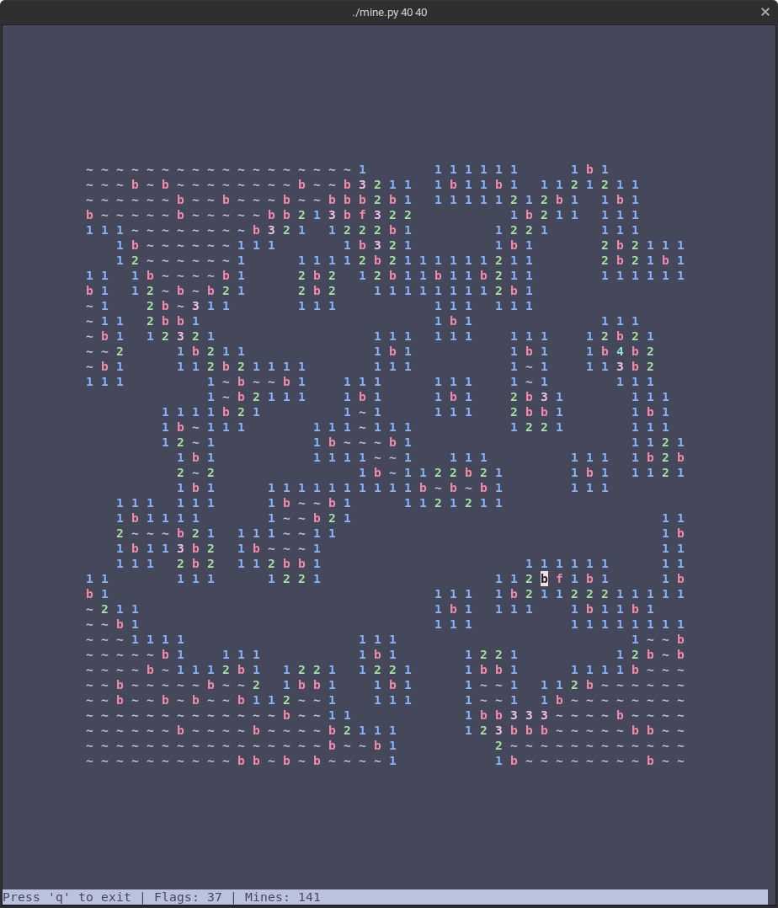
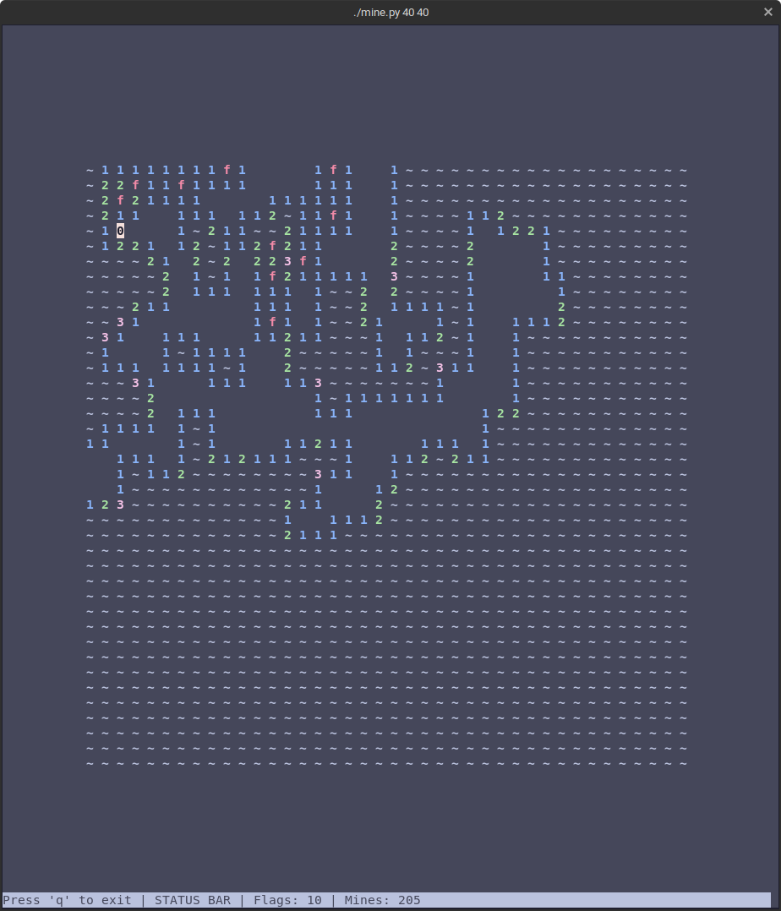

# csweeper

*csweeper* is a lightweight minesweeper clone that runs in any UNIX-based terminal. It is programmed entirely in
Python using the curses module, and follows all the same rules as the original PC game.

  
  

### Download
- `git clone` the repository
- `cd` into the `csweeper` directory
- `./mine.py X Y` to run the game with board size X by Y

### Keys
- `WASD` to move
- `space` to open cell
- `f` to flag